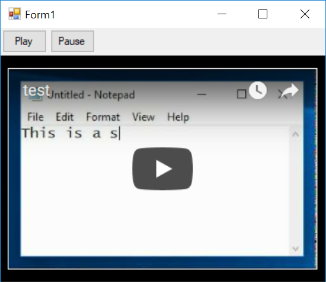

# Play Youtube Video in Windows Forms

You can use a `WebBrowser` control to show embedded youtube video. To do so, it's enough to use an iframe inside the control to embed the youtube video.

Youtube also has an API called [YouTube Player API for iframe Embeds](https://developers.google.com/youtube/iframe_api_reference). It allows you to control the player using javascript code.
To be able to use that script API, you should load the `iframe` by adding `enablejsapi=1` to query string. 

When playing youtube video:
1. YOu need to add "<meta http-equiv=\"X-UA-Compatible\" content=\"IE=Edge\"/>" to load WebBrowser control in edge mode. 

2. You should make sure you use the correct url. For example for a video that you can see at this address: `https://www.youtube.com/watch?v=L6ZgzJKfERM`, the embed url is `https://www.youtube.com/embed/L6ZgzJKfERM`.

3. Also you should make sure the video is allowed to be played as embedded. Some videos are just allowed to play on youtube and after you click on play button you receive this error:

   > This video contains content from XXXXXX. It is restricted from
   > playback on certain sites or applications.

4. You can cal the scripts which you create in html from windows forms, put it in a function in your html code, then call it using [`WebBrowserDocument.InvokeScript()`](https://msdn.microsoft.com/en-us/library/4b1a88bz(v=vs.110).aspx) method of the broswer control.
